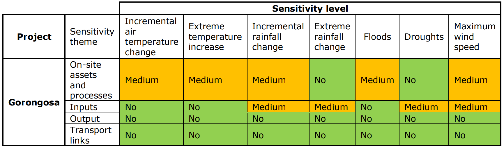

# 
 CRVA_tool

This tool applies Climate Risk and Vulnerability Assessment (CRVA) method, developed in [Non-paper Guidelines for Project Managers: Making vulnerable investments climate resilient](https://climate-adapt.eea.europa.eu/en/metadata/guidances/non-paper-guidelines-for-project-managers-making-vulnerable-investments-climate-resilient/guidelines-for-project-managers.pdf).

The tool was used in a master Thesis, [publically available](https://infoscience.epfl.ch/record/304715?&ln=fr).

# Summary of README

- [Functions](#Function)
- [Download and format data](#DownloadAndFormatData)
- [Bias correction](#BiasCorrection)
- [Application for the CRVA tool](#ApplicationCRVA)
	- [Import data](#ImportData)
	- [Indicators](#Indicator)
	- [Vulnerability](#Vulnerability)
		- [Sensitivity](#Sensitivity)
		- [Exposure](#Exposure)
		- [Determination of vulnerability](#DetVulnerability)
	- [Risk](#Risk)
- [StudyCase-Gorongosa_Mozambique](#StudyCaseGorongosa)
	- [Observed data](#StudyCaseObservedData)
	- [Validation of data](#ValidationData)
	- [Bias correction results](#BCResults)
- [What to still implement](#ToImplement)
- [*Commands* and explanations](#Commands)
	- [Packages installed](#Packages)
	- [Resolving errors](#ResolvingErrors)

# 0-Functions
This folder contains all the functions used during the process.

# 1-DownloadAndFormatData
## Modelled data
To study future risk, climate projections are used. Here, NEX-GDDP-CMIP6 dataset, [produced by NASA](https://www.nccs.nasa.gov/services/data-collections/land-based-products/nex-gddp-cmip6) is used because it is a dataset bias corrected and downscaled to the resolution 0.25 degree. The process to obtain this dataset was to bias corrected and downscale [CMIP6 data](https://cds.climate.copernicus.eu/cdsapp#!/dataset/projections-cmip6?tab=overview). The dataset contains 9 climate variables, for several experiments and models ([Detailed paper about the dataset](https://www.nature.com/articles/s41597-022-01393-4)).

For this tool, NEX-GDDP-CMIP6 data were downloaded with [Download_NEX-GDDP-CMIP6.py](https://github.com/RaphaelPB/CRVA_tool/blob/main/1-DownloadAndFormatData/Download_NEX-GDDP-CMIP6.py), using the csv file made available by NASA [here page 16](https://www.nccs.nasa.gov/sites/default/files/NEX-GDDP-CMIP6-Tech_Note.pdf).

Once the data are downloaded, it is needed to reformate them from nc files (with one file for ssp and model) to csv files with every models and SSP for every point with [CSV_NEX-GDDP-CMIP6_one_lat_lon](https://github.com/RaphaelPB/CRVA_tool/blob/main/1-DownloadAndFormatData/CSV_NEX-GDDP-CMIP6_one_lat_lon.py).

# 2-BiasCorrection
Climate projections often have biases. To deal with them, it is possible to perform bias correction. For this tool, bias correction applied is BCSD method ([Wood 2004](https://link.springer.com/article/10.1023/B:CLIM.0000013685.99609.9e)), implemented thanks to [scikit-downscale package](https://github.com/pangeo-data/scikit-downscale). In the end, only the quantile mapping step is performed, and not the downscaling. The [BC_NEX-GDDP-CMIP6](https://github.com/RaphaelPB/CRVA_tool/blob/main/2-BiasCorrection/BC_NEX-GDDP-CMIP6.ipynb) ([folder 2-BiasCorrection](https://github.com/RaphaelPB/CRVA_tool/tree/main/2-BiasCorrection)) applies functions BCSD_Temperature_return_anoms_to_apply and BCSD_Precipitation_return_anoms_to_apply from [Bias_correction_function](https://github.com/RaphaelPB/CRVA_tool/blob/main/0-Functions/Bias_correction_function.py) ([folder 0-Functions](https://github.com/RaphaelPB/CRVA_tool/tree/main/0-Functions)) on respectively temperature and precipitation NEX-GDDP-CMIP6 dataset.

In folder [Archives-BiasCorrectionTests](https://github.com/RaphaelPB/CRVA_tool/tree/main/Archives-BiasCorrectionTests), other bias correction tests are gathered.

# 3-CRVA_Tool
Application of the method is all in [CRVA_data_analyst](https://github.com/RaphaelPB/CRVA_tool/blob/main/3-CRVA_Tool/CRVA_data_analyst.ipynb). The application of the tool was done with data from the Gorongosa study.

## Import data
Before performing any indicators, data are imported thanks to functions in [Functions_ImportData](https://github.com/RaphaelPB/CRVA_tool/blob/main/0-Functions/Functions_ImportData.py) ([folder 0-Functions](https://github.com/RaphaelPB/CRVA_tool/tree/main/0-Functions)).

## Indicators
In folder [0-Functions](https://github.com/RaphaelPB/CRVA_tool/tree/main/0-Functions), [Functions_Indicators](https://github.com/RaphaelPB/CRVA_tool/blob/main/0-Functions/Functions_Indicators.py) contains the indicators that can be used and that are explained in the table below.

% \usepackage{multirow}
\begin{table}[]
\centering
\caption{Indicator available in the {[}Functions\_Indicators{]}(https://github.com/RaphaelPB/CRVA\_tool/blob/main/0-Functions/Functions\_Indicators.py) in folder {[}0-Functions{]}(https://github.com/RaphaelPB/CRVA\_tool/tree/main/0-Functions)}
\label{tab:my-table}
\begin{tabular}{lllll}
Climate   variables changes                         & Indicators                                                                        & Code to obtain the indicator                                                                                                                                                                                                                                                                                                                                                                                                                                                                  &  &  \\
Incremental air temperature   change                & Average temperature per year                                                      & \makecell{With the ' Daily Near-Surface  Air Temperature °C' (tas), for each scenario and for each model,\\the average   temperature per year is calculated with the function 'temporal\_avg'.}                                                                                                                                                                                                                                                                                                           &  &  \\
\multirow{3}{*}{Extreme air temperature   increase} & \makecell{Maximum temperature in year                                                       & With the 'Daily Maximum Near-Surface Air Temperature °C' (tasmax), \\apply function 'temporal\_max'.}                                                                                                                                                                                                                                                                                                                                                                                            &  &  \\
                                                    & Daily maximum temperature                                                         & use the 'Daily Maximum Near-Surface Air Temperature °C' (tasmax)                                                                                                                                                                                                                                                                                                                                                                                                                              &  &  \\
                                                    & Annual number of days with temperature above a certain threshold temperature      & With the 'Daily Maximum Near-Surface Air Temperature °C' (tasmax), apply 'number\_day\_above\_threshold'.                                                                                                                                                                                                                                                                                                                                                                                     &  &  \\
\multirow{2}{*}{Incremental rainfall change}        & Average yearly precipitation                                                      & \makecell{With the precipitation data, used the function 'temporal\_avg' with temporal\_resolution (fourth input) as 'year'.\\This gave the average yearly precipitation for each SSP and model}                                                                                                                                                                                                                                                                                                        &  &  \\
                                                    & Average monthly dry or wet season precipitation                                   & \makecell{With the precipitation data corresponding to the dry or wet season, used the function\\'temporal\_avg' with temporal\_resolution (fourth input) as 'month'. This gave the average monthly precipitation for each SSP and model.\\The wet season goes from October to March ([Uamusse 2020](https://www.mdpi.com/2076-3417/10/14/4842))}                                                                                                                                                                                               &  &  \\
\multirow{4}{*}{Extreme rainfall change}            & Maximum one day rainfall                                                          & \makecell{With the precipitation data, used the function 'temporal\_max'. Depending on if the user wants\\the maximum one-day rainfall per month or per year, the fourth input of the function should,\\respectively, be 'month' or 'year'. The result will be the maximum value of precipitation per month or per year,\\for each SSP and each model. The user can also use the 'dataframe\_1\_day\_event' ;\\the result will be the maximum value of precipitation per year,\\for each SSP and each model.} &  &  \\
                                                    & Maximum five days rainfall                                                        & With the precipitation data, 'dataframe\_max\_5\_days\_event'.                                                                                                                                                                                                                                                                                                                                                                                                                                &  &  \\
                                                    & Event with 100 year return period                                                 & \makecell{With the precipitation data, function 'dataframe\_threshold\_coresponding\_to\_return\_period\_model'.\\The right-skewed gumbel distribution was chosen for the probability distribution function of the precipitation data ([scipy.stats.gumbel_r](https://docs.scipy.org/doc/scipy/reference/generated/scipy.stats.gumbel_r.html)).\\The extreme values were selected with the [Annual Maxima method](https://www.sciencedirect.com/science/article/pii/S2214581820302457)}                                                                                                                                                                                          &  &  \\
                                                    & Future return period of one day rainfall event with a current return of 100 years & \makecell{With the precipitation data, 'dataframe\_return\_period\_coresponding\_to\_past\_100year\_event\_model'\\but the results are not as excepted. This function should be bettered.}                                                                                                                                                                                                                                                                                                                &  & 
\end{tabular}
\end{table}

Evaluate the evolution of Net Precipitation would be useful for some infrastructure. the work was started and is in the folder [InProcess-NetPrecipitation](https://github.com/RaphaelPB/CRVA_tool/tree/main/InProcess-NetPrecipitation).

## Vulnerability

### Sensitivity
Sensitivity is based often on expert judgement. It is evaluated outside of the tool. It should be summarized in a matrix format (as example below), and added to the tool with the function *sensitivity*; this function is defined in [Functions_ImportData](https://github.com/RaphaelPB/CRVA_tool/blob/main/0-Functions/Functions_ImportData.py) ([folder 0-Functions](https://github.com/RaphaelPB/CRVA_tool/tree/main/0-Functions)).

### Exposure
In this step, two sets of data are compared; one from the past and form the future. Every functions in this step is in [Functions_Indicators](https://github.com/RaphaelPB/CRVA_tool/blob/main/0-Functions/Functions_Indicators.py) in ([folder 0-Functions](https://github.com/RaphaelPB/CRVA_tool/tree/main/0-Functions)).
- Calculate statistics of the period with function *df_stat_distr*
- Change between past and future statistics with function *changes_in_indicators*
- Based on change between past and future, categorization in low, medium, or high Exposure with function *level_exposure*

### Determination of vulnerability
Crossing information from sensitivity and exposure with function, the final vulnerability to climate variables can be known with function *vulnerability* from [Functions_Indicators](https://github.com/RaphaelPB/CRVA_tool/blob/main/0-Functions/Functions_Indicators.py) in ([folder 0-Functions](https://github.com/RaphaelPB/CRVA_tool/tree/main/0-Functions)).

## Risk
The severity, as the sensitivity, is often based on expert judgement. It is not applied in the tool.

The likelihood is applied in this tool, with the function *likelihood_accross_models_and_ssps* [Functions_likelihood](https://github.com/RaphaelPB/CRVA_tool/blob/main/0-Functions/Functions_likelihood.py) in ([folder 0-Functions](https://github.com/RaphaelPB/CRVA_tool/tree/main/0-Functions))

Crossing information from severity and likelihood was not done in this tool.

# 4-StudyCase-Gorongosa_Mozambique

## Observed data
For the study case in Gorongosa, the tool uses some observation data from NOAA. Some of them were absurd and were therefore treated with [Treat Data tas NOAA Station and pr meteorological station Gorongosa](https://github.com/RaphaelPB/CRVA_tool/blob/main/4-StudyCase-Gorongosa_Mozambique/Treat%20Data%20tas%20NOAA%20Station%20and%20pr%20meteorological%20station%20Gorongosa.ipynb).

## Validation of data
To confirm the use of NEX-GDDP-CMIP6 dataset as representative of the location of interest, modelled temperature and precipitation were compared to observation data in [Compare NOAA station and NEXGDDP CMIP6 data in Chimoio](https://github.com/RaphaelPB/CRVA_tool/blob/main/4-StudyCase-Gorongosa_Mozambique/Compare%20NOAA%20station%20and%20NEXGDDP%20CMIP6%20data%20in%20Chimoio.ipynb).

## Bias correction results
BCSD is a bias correction method ([Wood 2004](https://link.springer.com/article/10.1023/B:CLIM.0000013685.99609.9e)), performing first quantile mapping, and then downscaling. It was performed on NEX-GDDP-CMIP6 at Gorongosa location with the package [scikit-downscale](https://github.com/pangeo-data/scikit-downscale), with its functions BcsdPrecipitation and BcsdTemperature. Results were compared with observation data from NOAA website in [Compare NOAA station and BC NEXGDDP CMIP6 data](https://github.com/RaphaelPB/CRVA_tool/blob/main/4-StudyCase-Gorongosa_Mozambique/Compare%20NOAA%20station%20and%20BC%20NEXGDDP%20CMIP6%20data.ipynb).

# What to still implement or better
- Implement the tool for other climate variables (example sea level rise)
- Use other sources of modeled data: [CMIP6](https://cds.climate.copernicus.eu/cdsapp#!/dataset/projections-cmip6?tab=overview) or [CORDEX](https://cds.climate.copernicus.eu/cdsapp#!/dataset/projections-cordex-domains-single-levels?tab=form)
- Use data combining observation (satellite and in-situ) and model data as observation data ([such as the ones produced with algorithm CRU or CHIRPS](https://cds.climate.copernicus.eu/cdsapp#!/dataset/insitu-gridded-observations-global-and-regional?tab=form))
- Select models performing better with [advanced envelope-based selection approach](https://rmets.onlinelibrary.wiley.com/doi/full/10.1002/joc.4608)
- Concerning bias correction, need to check stationarity of the biases if quantile mapping is to be applied ([Cannon and al. 2015](https://journals.ametsoc.org/view/journals/clim/28/17/jcli-d-14-00754.1.xml), [Nahar 2017](https://www.sciencedirect.com/science/article/abs/pii/S0022169417301919?fr=RR-2&ref=pdf_download&rr=7facf5b1dae57373)). But [quantile delta mapping] (https://journals.ametsoc.org/view/journals/clim/28/17/jcli-d-14-00754.1.xml) or [scaled delta mapping](https://hess.copernicus.org/articles/21/2649/2017/) looks more adapted to bias corrected precipitation data. Always for precipitation data, a parametric distribution should be used instead of a non-parametric one ([Bum Kim K and al. 2014](https://www.researchgate.net/publication/265968260_An_improved_bias_correction_scheme_based_on_comparative_precipitation_characteristics), (Heo and al. 2019](https://www.mdpi.com/2073-4441/11/7/1475), [Cannon and al. 2015](https://journals.ametsoc.org/view/journals/clim/28/17/jcli-d-14-00754.1.xml)).
- Other indicator could be implemented. The more relevant one could be the ones looking into consecutive days of hot temperature, leading to heatwaves ([Zacharias and al. 2015](https://www.mdpi.com/2225-1154/3/1/100))
- The indicator '100-year event' could looks for a better distribution of the dataset, instead of directly taking a right-skewed Gumbel distribution function. This last one is often used for precipitation data ([Moccia and al. 2020](https://www.sciencedirect.com/science/article/pii/S2214581820302457))
- In the exposure step, adapt the thresholds used to categorize the level of exposure
- Calculate yearly probability event with likelihood
- Looking into risks of two hazards occurring at the same moment or to risk of consecutives events ([Marleen 2020](https://agupubs.onlinelibrary.wiley.com/doi/full/10.1029/2019EF001425)) could also be a next step

# *Commands* and explanations

## Packages installed: 
This paragraph contains all the packages that were installed during the project. Thy are cited in the chronological order where they were installed.
- Environment initially created as following .*conda create -n geodata -c conda-forge python=3.10.6 geopandas=0.12.1 pandas=1.5. pysheds=0.3.3 rasterstats=0.17.0 rasterio=1.3.3 numpy=1.23.4 seaborn matplotlib netcdf4=1.6.1*
- *pip install jupyter notebook*: to use this environment in jupyter notebook
- *pip install numpy matplotlib*: to use those 2 packages on the environment. Use for many different purposes (numbers and plots)
- *pip3 install -U matplotlib* [upgrade of matplotlib to have access to colors for matplotlib](https://stackoverflow.com/questions/47497097/module-matplotlib-has-no-attribute-colors)
- *python -m pip install rioxarray*
- *conda install cdsapi*: to download copernicus data
- *conda install basemap*, then pip install basemap-data: to map nc files (more infos on [stackoverflow 1](https://stackoverflow.com/questions/33020202/how-to-install-matplotlibs-basemap) and [stackoverflow 2](https://stackoverflow.com/questions/47587670/how-to-install-basemap-in-jupyter-notebook))
- *pip install bias-correction*: to perform bias correction, infos on module [here](https://pankajkarman.github.io/bias_correction/index.html#bias_correction.gamma_correction) 
- *pip install python-cmethods*: other package to perform Bias correction ([python-cmethods Github here](https://github.com/btschwertfeger/python-cmethods#installation))
- *conda install --channel conda-forge pysal*: to map projects on a map ([Pysal library](http://pysal.org/pysal/) and [Installation Pysal](http://pysal.org/pysal/installation.html))
- *conda install -c conda-forge r-nasaaccess*: to have access to have access to climate and earth observation data, but not use in the end ([Github scikit downscale](https://github.com/pangeo-data/scikit-downscale))
- Attempt to install scikit learn and scikit-downscale, install all the following dependencies, but package scikit-downscale still not working : scipy, scikit-learn, dask, docopt, zarr   , ipython, sphinx, numpydoc, sphinx_rtd_theme, pangeo-notebook, mpl-probscale, pydap, gcsfs, pwlf, sphinx-gallery, mlinsights. In the end, clone scikit downscale repository from the [website of the package](https://github.com/pangeo-data/scikit-downscale). This worked
- *pip install h5netcdf*: to manage those types of files ([Gitbud h5netcdf](https://github.com/h5netcdf/h5netcdf))
- *pip install geopy*: to calculate distance between two geographical points ([stackoverflow explanation of geopy](https://github.com/h5netcdf/h5netcdf) and [python library geopy](https://pypi.org/project/geopy/))
- *pip install Nio* :, to increase speed of reading NEtCDF files ([stackoverflow explanation](https://stackoverflow.com/questions/34159747/efficient-reading-of-netcdf-variable-in-python))

## Resolving errors:
Some errors occurred during the project. Here are the command performed to deal with those errors.
- Data attribute error: Upgrade pandas to deal with it ([stackoverflow explanations](https://stackoverflow.com/questions/67165659/how-to-update-pandas-for-jupyter-notebook))
- Problem ValueError: did not find a match in any of xarray's currently installed IO backends. To resolve that:
*python -m pip install xarray*
*python -m pip install "xarray[io]"*
*python -m pip install git+https://github.com/pydata/xarray.git*
- Raising error RuntimeWarning: Engine 'cfgrib' loading failed:
try to install *conda install -c conda-forge python-eccodes*, did not work, conflicting packages apparently
try *pip install ecmwflibs*, with import ecmwflibs import eccodes in the script  installed, worked

